## 1. Components & Responsibilities (high level)

### External Data Sources
-	Social/media & messaging: Telegram, X, FB, IG, TikTok, VK, forums, darknet, etc.
-	News & press: multi-lingual media, official press releases.
-	CTI: vendor reports, public CTI feeds, MITRE, URLHaus, VirusTotal, etc.
-	Geo/satellite/aerial: Sentinel/Copernicus, EUMETSAT, NASA, drones.
-	Infrastructure & registries: OSM, CI datasets, WHOIS/DNS, domain registries, public protest registries.

### Ingestion & Streaming
-	Connectors & scrapers (per source).
-	API clients, RSS readers, file collectors (PDF/CSV, satellite products).
-	Validation, de-duplication, basic normalisation.
-	Streaming bus (e.g. Kafka) for real-time feeds.

### Raw & Processed Data Storage
-	Data lake / object store for raw + intermediate artefacts.
-	Document store (e.g. MongoDB) for enriched documents.
-	Relational DB (PostgreSQL) for core entities and configuration.
-	Search index (Elastic/OpenSearch) for full-text search.
-	Graph DB for entities/relations.
-	Geospatial store (PostGIS) for map-heavy queries.
-	Labelled dataset store for ML training data.

### Processing & Enrichment
-	ETL pipelines (batch + streaming).
-	NLP services (classification, NER, event extraction).
-	CV services (image/video analysis).
-	Geo-enrichment (reverse geocoding, OSM overlays, CI proximity).
-	STIX/TAXII normalisation & CTI entity extraction.

### Labelling & ML Lifecycle
-	Pre-labelling / weak supervision service.
-	Annotation UI & backend.
-	Training pipelines, feature store, model registry.
-	Online & batch inference services.
-	MLOps monitoring (drift, performance).

### Threat Analytics & Correlation
-	Knowledge graph builder.
-	Correlation & fusion engine (merge entities/events).
-	Rules engine (deterministic logic).
-	Statistical & ML-based anomaly detection.
-	Risk scoring & prioritisation.

### Frontend & Integrations
-	Analyst UI (dashboards, graphs, timelines, maps).
-	Case management & investigation workbench.
-	Admin/config UI (sources, rules, risk models).
-	APIs & webhooks for SIEM/TIP/SOC tools (STIX/TAXII, REST, etc.).

### Security & Governance (cross-cutting)
-	Identity & access management.
-	Auditing & logging.
-	Data lineage & provenance tracking.
-	Privacy, legal & policy enforcement.

⸻

## 2. Modular Breakdown (services/modules)

You can think of these as microservices / domains:
1.	Source Connectors
    - social-media-connector-*, news-collector, cti-feed-ingestor, satellite-fetcher, dns-whois-collector, etc.
2.	Ingestion & Streaming
    -	ingestion-gateway (auth, rate limiting, validation)
    -	stream-router (routes events to topics)
    -	Kafka (or similar) topics per source/type.
3.	ETL & Enrichment
    -	etl-orchestrator
    -	text-normalizer (language detection, cleaning)
    -	nlp-enricher (classification, NER, event extraction)
    -	cv-enricher (image/video models)
    -	geo-enricher
    -	stix-normalizer (emits STIX objects/relationships)
4.	Storage Services
    -	raw-store-service
    -	document-store-service
    -	search-index-service
    -	graph-store-service
    -	geo-store-service
    -	timeseries-store-service (optional for metrics/logs)
5.	Labelling / Annotation
    -	prelabelling-service (rules, weak supervision, model-aided)
    -	annotation-backend
    -	annotation-ui
    -	gold-dataset-service
6.	ML Platform
    -	feature-store
    -	training-orchestrator
    -	model-registry
    -	online-inference-service
    -	batch-inference-service
    -	ml-monitoring-service
7.	Threat Analytics & Correlation
    -	knowledge-graph-builder
    -	correlation-engine
    -	rules-engine
    -	anomaly-engine
    -	risk-scoring-service
    -	alerting-service
8.	APIs & Frontend
    -	query-api (for UI and external integrations)
    -	alert-api / webhook-dispatcher
    -	analyst-ui (dashboards, graph, map)
    -	admin-ui
9.	Security & Governance
    -	auth-service
    -	policy-engine (data access, retention rules)
    -	audit-log-service
    -	config-service (central config & feature flags)

⸻

## 3. Diagrams

#### 3.1 High-level Overall Layered System Design (Layers only)

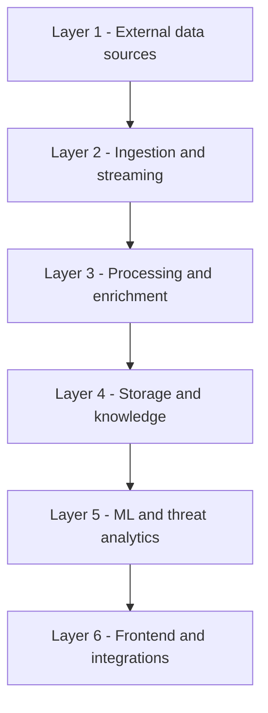

#### 3.2 Compact Vertical Overall Design (few components per layer)
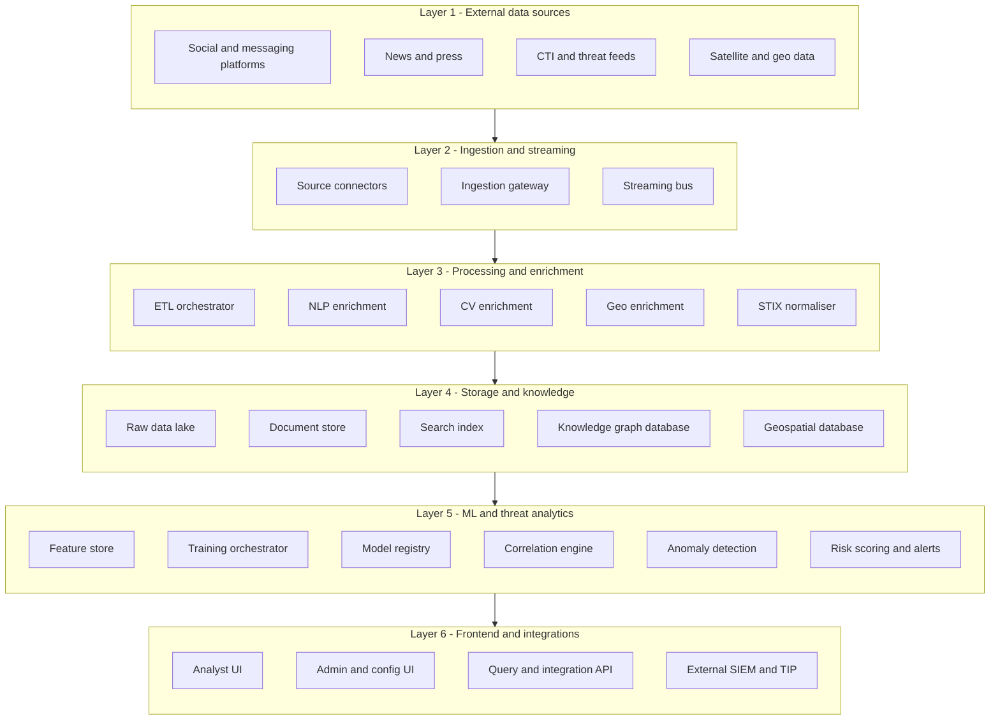

#### 3.3 Layers

##### 3.3.1 Layer 1 – External Data Sources

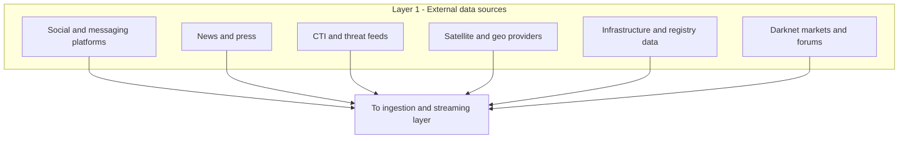
#### 3.3.2 Layer 2 – Ingestion and Streaming

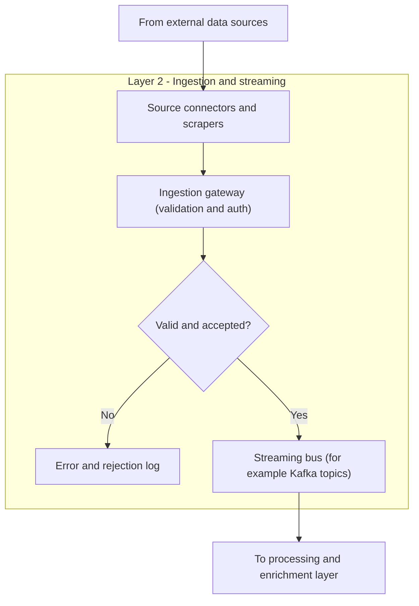

#### 3.3.3 Layer 3 – Processing and Enrichment
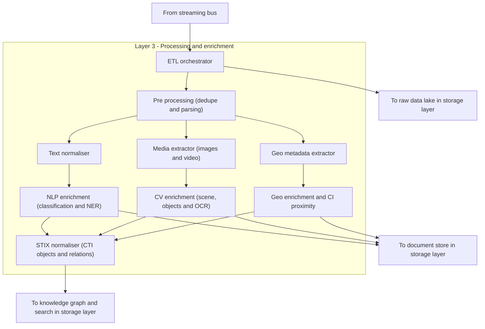

#### 3.3.4 Layer 4 – Storage and Knowledge

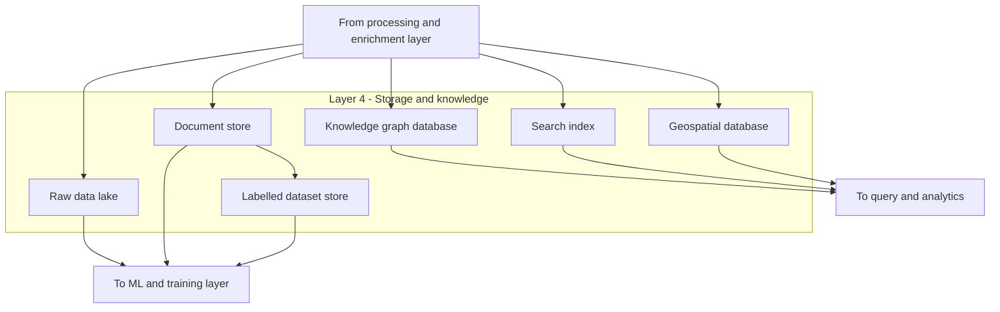

#### 3.3.5 Layer 5 – ML and Threat Analytics

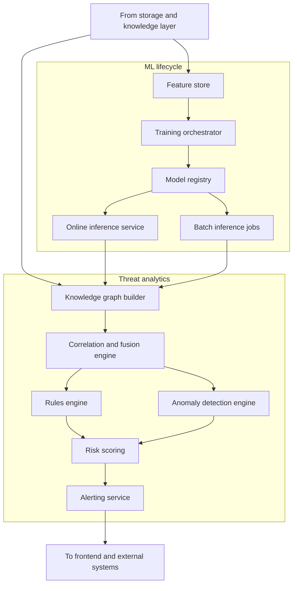

#### 3.3.6 Layer 6 – Frontend and Integrations
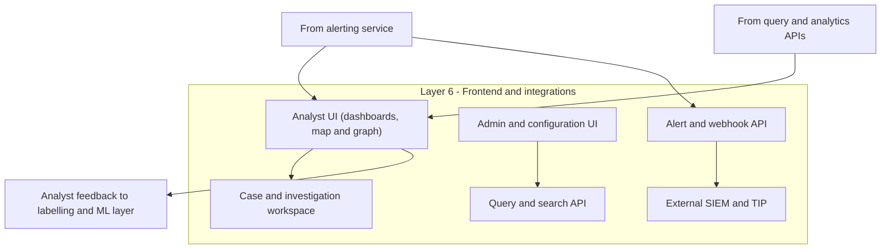
⸻

### 3.4 End-to-End Alerting Sequence (Sequence Diagram)

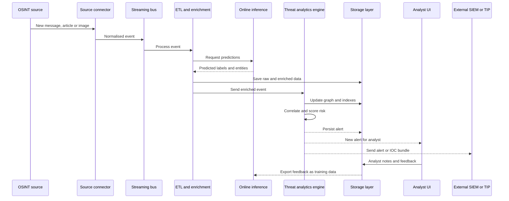

### 3.5 Overall Layered System Design

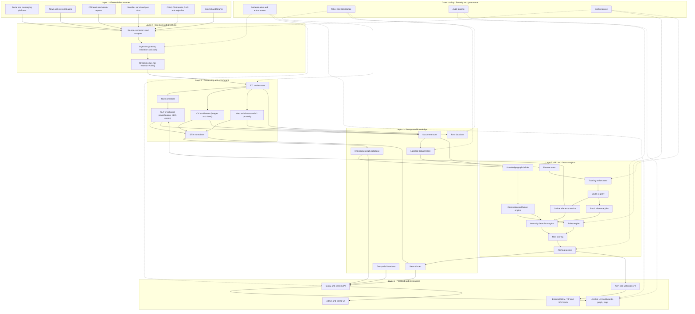

### 3.6 Selected focus viewa 

#### 3.6.1 Data Ingestion & Processing Flow (Flowchart)

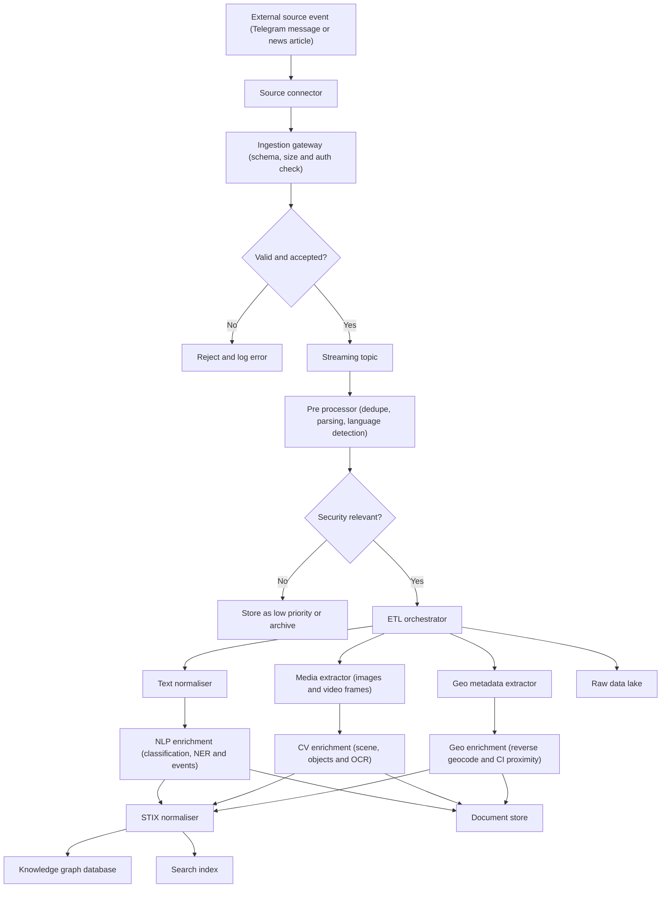

⸻

### 3.6.2 Labelling & ML Lifecycle (Flowchart)

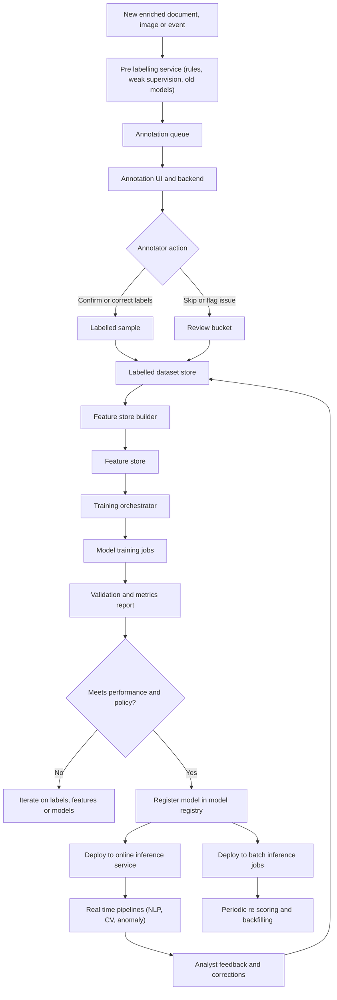

⸻
